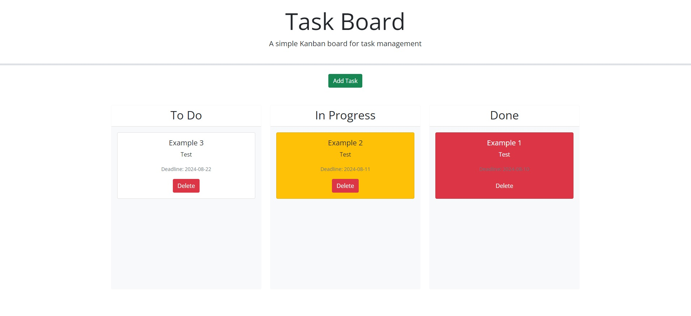

# Task Board

## Description
This application is a simple Kanban Task Board, used to divid up tasks by To Do, In Progress, and Done. The tasks can easily be moved between the three columns by simply dragging and dropping the tasks. The tasks will change color based on the deadline. They will default to white, then change to yellow when the deadline is nearing. For tasks that are due today or are past due, they will change to red. 

## Table of Contents
* [Installation](#installation)
* [Usage](#usage)
* [License](#license)
* [Contributing](#contributing)
* [Credits](#credits)
* [Questions](#questions)

## Installation
N/A

## Usage
To utilize this application, simply navigate to the deployed application link below. The user will be brought to a blank kanban board. To create a new task, simply click the green "Add Task" button. This will open a modal where the user can enter the task title, description, and deadline. From here they can save changes. The new task will populate in the "To Do" column. Then the user can simply drag and drop the task between all three columns. The user can select the delete button on the task at any time.

View the deployed application [here](https://hannahpsmith.github.io/task-board/)

## License
N/A

## Contributing
Please contact me for contributions to the repo.

## Credits
N/A

## Questions
Please contact me with any questions.

Github: hannahpsmith (https://github.com/hannahpsmith)

Email: hannahpsmith94@gmail.com
